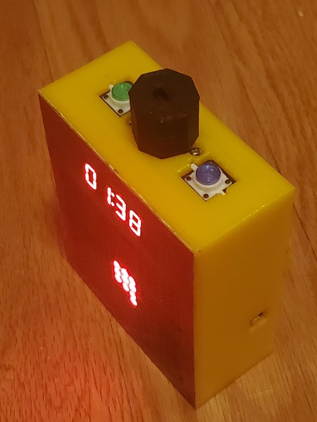
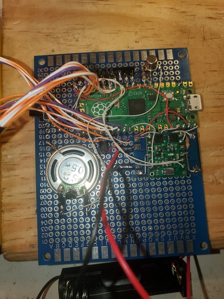
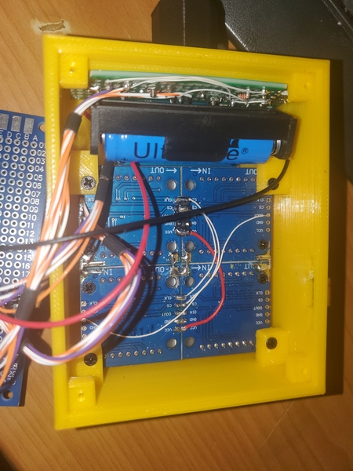
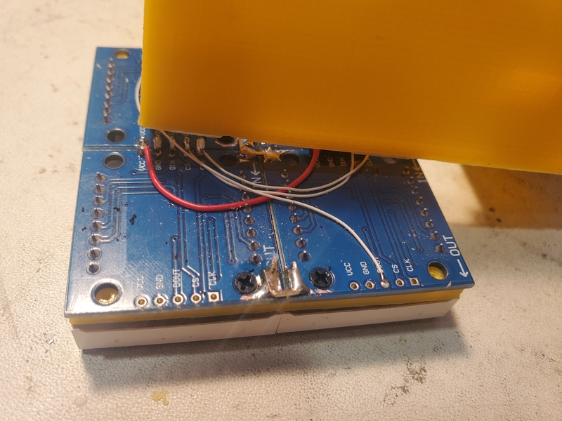

Timer with 16x16 dot display
----------------------------



Parts used
----------

The links are to aliexpress and things often disappear there.. so you might need to shop based on the pictures.
Also, I mostly used parts I had on hand already, hence so many different sellers. If buying all the parts for
this project, get similar looking ones from one seller.

- Raspberry PI PICO (non-W version,
  get one from your [local hardware store](https://www.microcenter.com/product/661033/raspberry-pi-pico-microcontroller-development-board))
- 4x 8x8 dot displays, based on MAX7219 chipset. You want the ones which can be stacked next to each other, with no protruding parts.
  I used red ones from my parts box. [Those](https://www.aliexpress.us/item/3256805799080954.html) look the same.
- 1x 0.36" 4-digit LED indicator, driven by TM1637. I used red one from my parts box, but it looks like 
  [this one](https://www.aliexpress.us/item/3256804119383891.html).
    - Had to desolder headers and attach wires directly instead.
- Input panel:
    - 2x buttons with LEDs (blue and green), "12x12" type ([those](https://www.aliexpress.us/item/2255799843768811.html)) 
    - Rotary encoder from my parts box.
    - Small piece of PCB to mount this all on. I've had [2x8cm proto PCB](https://www.aliexpress.us/item/3256804759687459.html) I've cut in half.
    - Pull-up resistors (I found 10x 2.2K resistor array in my toolbox)
- 3d-printed case, see [3dprint/] directory.
    - There are 3 parts: main body, holder for displays (goes between PCB and display itself) and encoder knob.
- Protoboard PCB, 70x90 mm ([this one](https://www.aliexpress.us/item/2251832485396886.html), but others would work too. 
  Note the dimensions vary a bit, especially in hole placement. You might need to tweak 3D model for your speciic board).
- 3D printed case
- Some colored film to cover the front - this is supposed to increase contrast. 
  I had red film in my parts box, no idea where I got it from)
- Optional: speaker
    - Small speaker (piezo or 4-ohm one)
    - almost any transistor (I had 2N222 in my parts box)
    - a resistor for that transistor
- Optional: battery setup (see below for details)


Schematics
----------

Sorry, never made a schematics. There is a PCB which serves as a back cover and as a mechanical
support, but most wiring is point-to-point. Here is a pinout:
```
Pinout:
  (left side)
  GP0
  GP1

  GP2
  GP3
  GP4
  GP5

  GP6   O - speaker (active high, via 2N2222 transistor)
  GP7
  GP8  IO - POSSIBLE EXPANSION: IMU SDA  (w/2.2K pull-up)
  GP9  IO - POSSIBLE EXPANSION: IMU SCL  (w/2.2K pull-up)

  GP10  I - encoder A (w/2.2K pull-up)
  GP11  I - encoder B (w/2.2K pull-up)
  GP12  I - button green (w/2.2K pull-up)
  GP13  I - button blue (w/2.2K pull-up)

  GP14  O - LED green (270 ohm to GND, active high)
  GP15  O - LED blue (270 ohm to GND, active high)

  (right side)
  GP16  I - SPI RX (unused)
  GP17  O - SPI CSn to MAX7219 8x8 displays

  GP18  O - SPI SCK to MAX7219 8x8 displays
  GP19  O - SPI TX to MAX7219 8x8 displays
  GP20  O - DATA to TM1637
  GP21  O - CLK to TM1637

  GP22  O - set high to force power off
  GP23  I - on-board voltage regulator mode selector
  GP24  I - on-board USB voltage sensor
  GP25  O - on-board LED

  GP26
  GP27
  GP28
```

PCB, mostly point-to-point wiring, the only moderately complex system is power



The other side - enclosure with buttons and LEDs




Mechanical assembly
-------------------

See 3d-printed case, see [3dprint/] directory.
There are 3 parts: main body, holder for displays (goes between PCB and display itself) and encoder knob.

For 8x8 displays, I've used some thick wires to solder the groundplanes together, making a single 16x16 panel. 
This turned out to be not the best idea in retrospect - I've got flatness wrong so you can see (and feel) boundaries 
between modules. A better idea would be to 3D print holders and mount each one using default mounting holes.




Power control
-------------

For simpler design, feel free to skip. Connect Vin pins of display to 
pico's VSYS, and you have a USB-powered device.

Or get [Pimoroni's lipo SHIM](https://shop.pimoroni.com/products/pico-lipo-shim?variant=32369543086163), 
I have not tried it but specs look good.. seems like it basically does all I do here in one tiny board.
Just needs a transistor across the power button to allow soft power off (and a very minor case redesign,
as "USB" and "Power" would be just one hole now).

I wanted rechargable battery, so I went with:

- Battery itself: AA holder + 14500 3.7V Li-ion battery
    - Be wary of that a lot 14500 Li-ion batteries are apparently very low quality - one I got had 130 mAh capacity instead of rated 1800 mAh.
    - Alternatively, 18650 with tabs might fit and be both cheaper and more powerful
- Battery charger board (
    [Micro USB 5V 1A 18650 TP4056 Lithium Battery Charger Module Charging Board With Protection](https://www.aliexpress.us/item/2251832640561273.html))
- Power switch board (to enable soft power off). I used [Pololu Mini Pushbutton Power Switch](https://www.pololu.com/product/2808)
    - This turned out to be too easy to turn off by accident. I wonder if [Sparkfun's Soft Power Switch](https://www.sparkfun.com/products/17870),
      which requires power button to be held for a long time to turn off, would work better?
        - It would also allow eliminating separate power button entirely, allowing one of the two big buttons on top to act as power switch.
- Power on/off button (right-angle tactile switch)


Charger/protection board is generic TP4056 model
It came with 1A charge current, but I modified it to ~500mA current:
The current is set by resistor labeled R3.
The stock R3 was 122, which is 1.2K, which is ~1A.
I replaced it with 2201, which means 2.2K, which gave me ~0.56A limit.

Note that LEDs draw directly from battery, so the actual charging current is less
when display is on. Current use:

- pixels brightness 1: 80 to 240 mA, depending on # of pixeles lit
- pixels brightness 7: not measured, probably too bright

The overall schematics is somewhat complicated, because Pico and LEDs
have different power paths. This was because of requirements:

1. When powering from battery, give as much voltage to LEDs as possible, 
avoiding any diode drops (they are officially rated for 5V only after all, and I am powering
them from 3.6V lithium battery.. let's not make it worse).
2. Fully support operation when powered from pico's USB port.
3. Have "soft" power switch, with recessed button and software-controlled power-off. It should
   work even over USB.


```
 PICO:VBUS               GND
   |                      |
[ VIN+                   VIN- ]
[                             ]
[ charger / protection board  ]
[ (upside-down to expose LED) ]
[ modded to decrease Icharge  ]
[                             ]
[  OUT+ BATT+    BATT-  OUT-  ]
    |    |         |     |
    |    \- 14300 -/    GND
    |
    |              /-PICO:GP22
  /---\   /-GND-\  |  x   x
  |   |   |     |  |  |   |
[ IN+ IN+ GND GND ON OFF CTRL ]
[                             ]
[  POLOLU mini pushshbutton   ]
[   power switch (LV 2808)    ]
[                             ]
[ OUT OUT GND GND  SW-A  SW-B ]
   |   |  |     |    |     |
   \-|-/  \-GND-/    \-BTN-/    <- power button (outside)
     |
     +---PICO:3V3_EN   (so switch works even for USB input)
     +--[R:10K]--GND   (making sure 3V3_EN is pulled down with output is off)
     +--Vcc of LED displays
     |
     \--|>|--PICO:VSYS (use any diode, PI has regulator that'll step voltage up if needed)
```


Firmware
--------

1. Install [platformio](https://platformio.org/install). I use "core" version which is a simple command line tool.

2. Power up the device and plug in USB cable

3. `pio run -t upload`

4. If building for the very first time, it may fail because there is no bootloader in the image. In this case:

    - Power up/plug in device while holding "prog" button on the Pico board
    - Your computer should detect an removable disk dialog
    - The "pio run" error message should have mentioned an UF2 file location..
       Usually something like `.pio/build/pico/firmware.uf2`.
    - Copy this file to external disk. Device will auto-reboot into new firmware.
    - This only needs to be done once, once firmware is in place regular upload should just work..
   
